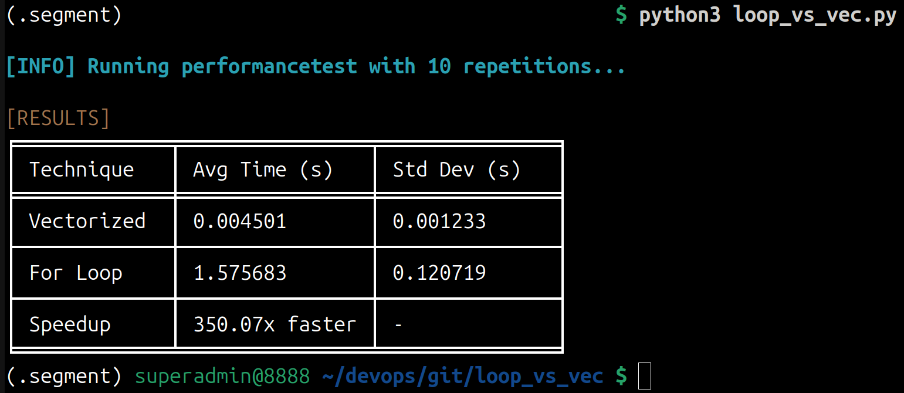

# 📈 Loop vs Vectorization Performance Test

## 📋 Overview

**Loop vs. Vectorization Performance Test** (`loop_vs_vec.py`) is a Python Performance Testing tool that compares the performance of **traditional for-loops** vs. **NumPy vectorized operations** when computing square roots over large datasets.

This project provides insights into performance optimizations using NumPy, helping programmers understand why **vectorization is significantly faster** than loops in numerical computing. 🏎️💨

----------

## 📂 Project Structure

```
loop_vs_vec/
├── loop_vs_vec.py  # Main Performance Testing script
├── requirements.txt # Python requirements
└── README.md       # Project documentation

```

----------

## ⚙️ Installation

To run this Performance Test, ensure you have **Python 3.+** installed.

---

Clone this GitHub repository:
```sh
 git clone https://github.com/LinuxSystemsEngineer/loop_vs_vec.git
```
---

Change directories into your newly cloned GitHub repository:
```sh
 cd loop_vs_vec
 ```
 ---
Create a segmented Python virtual environment:
```sh
python3 -m venv .venv
 ```
 ---
 
Activate the segmented Python virtual environment:
```sh
source .venv/bin/activate
 ```
---
Install the required Python packages using pip:
```sh
pip3 install -r requirements.txt
```

---

## 🚀 Usage

Run the Performance Test program with:

```sh
python3 loop_vs_vec.py
```


✔ Compute square roots using **NumPy vectorization** (fast ⚡)  
✔ Compute square roots using a **for-loop** (slow 🐌)  
✔ Measure execution times ⏱️  
✔ Calculate performance **speedup** 🚀  
✔ Display results in a **professionally formatted table** 📊

----------

## 📊 Example Output

```
[INFO] Running Performance Test with 10 repetitions...

[RESULTS]
╒══════════════╤════════════════╤═════════════════════════╕
│ Technique    │ Avg Time (s)   │ Standard Deviation (s)  │
╞══════════════╪════════════════╪═════════════════════════╡
│ Vectorized   │ 0.023456       │ 0.001234                │
│ For Loop     │ 1.234567       │ 0.012345                │
│ Speedup      │ 52.63x faster  │ -                       │
╘══════════════╧════════════════╧═════════════════════════╛

```

----------

## 🛠️ Technologies Used

✅ **Python 3**  
✅ **NumPy** (High-performance array computations)  
✅ **timeit** (Precise execution timing)  
✅ **statistics** (Calculating averages & deviations)  
✅ **tqdm** (Progress bar for loop execution)  
✅ **tabulate** (Professional table formatting)  
✅ **colorama** (Colored terminal output)

---

## 📜 License

This project is **open-source** under the MIT License. Feel free to fork and contribute!

---

## 💡 Contributing

Pull requests are welcome! If you have any suggestions for improvement, please open an issue or fork the repo. 

---

## Screenshots



---
